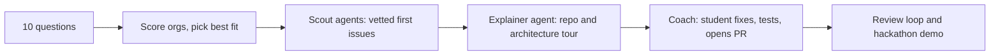

# oss-mentor

An AI mentor for open-source contribution with three modes, from learning by hand to fully automated. Built for hackathons and first-time contributors.

> Evolved from [`oss-bug-hunt`](https://github.com/havinash-007/oss-bug-hunt), which automated finding bugs and opening PRs. This version keeps that automation as one mode and adds two teaching modes.

## How it works



## Modes

| Mode | Who codes | Mentor role |
|---|---|---|
| 1. Learn | Student | Coach, hints only |
| 2. Semi-auto | Student vibe-codes with AI, in small chunks | Pair: quizzes the student on every chunk |
| 3. Full-auto | Worker agents | Coordinator: verifies PRs, tracks status |

Details and gates: [`learn/modes.md`](learn/modes.md).

1. **Interview.** Ten questions: mode, languages, skill, interests, goal, time, Git level, contribution type, machine, legal/AI comfort (`mentor/questions.md`).
2. **Pick an organisation.** A weighted rubric scores the catalogue in `mentor/orgs.json`; the top three are shown with the reasoning, and the student decides. Live checks with `gh` confirm the org is active and AI-policy compatible.
3. **Scout agents** (parallel, read-only) find first issues that are unclaimed, small, reproducible, and testable.
4. **Explainer agent** writes a repo tour: architecture diagram, directory map, request flow, build and test commands, files to read first.
5. **Coach** guides the fix with a hint ladder, reviews like a maintainer, and helps the student write an honest PR in their own words.
6. **Hackathon mode** gives a timeline and a 3-minute demo structure.

## Web app

```bash
./run.sh   # then open http://localhost:8000
```

FastAPI backend plus a single-page UI: interview, org match, scout, repo tour, coach chat, and a **PR replies** tab that drafts answers to reviewers (sending is off by default). A spend meter and USD budgets keep API credits in check. Put `ANTHROPIC_API_KEY` in `.env`. Full context for the team: [`docs/PROJECT_CONTEXT.md`](docs/PROJECT_CONTEXT.md).

**UI v2** (default at `/`): six self-contained Tailwind + React components in `frontend/v2/` (`HeroSection`, `InterviewStep`, `MatchPodium`, `IssueBoard`, `WorkspaceView`, `RepliesInbox`) plus a small shell (`app.jsx`). No build step: `index.html` loads React, Tailwind and Babel from CDNs and transpiles the `.jsx` files in the browser. Each component needs only React and has a header comment listing what to customise. The original page is still at `/classic`. See `docs/PRD-ui-v2.md` for the product thinking (the shipped build follows the bold-component approach, not the React/Vite rebuild proposed there).

## Use it in Claude Code

```bash
cd oss-mentor
claude            # then type: /oss-mentor
```

Requires the `gh` CLI, authenticated (`gh auth login`).

## Layout

| Path | Purpose |
|---|---|
| `.claude/skills/oss-mentor/SKILL.md` | The mentor flow (the `/oss-mentor` command) |
| `agents/` | Rules and prompts: scout, explainer, coach, pair, worker |
| `tools/pr_status.py`, `prs.json` | Full-auto PR tracker (starts empty) |
| `mentor/` | Questions and rubric, org catalogue, per-student profile and journal |
| `learn/` | PR template, hackathon playbook, generated repo tours |
| `archive/` | Original bug-hunt files, including the author's scoreboard |

## Principles

In modes 1-2 students write or review and understand every line. In every mode: legal sign-offs (DCO/CLA) belong to the human, AI policies are respected and disclosed, PR text is truthful, quality over volume.

## Caveats

`orgs.json` ratings are judgement, not measurements, and projects change their policies. Verify live before committing time.
