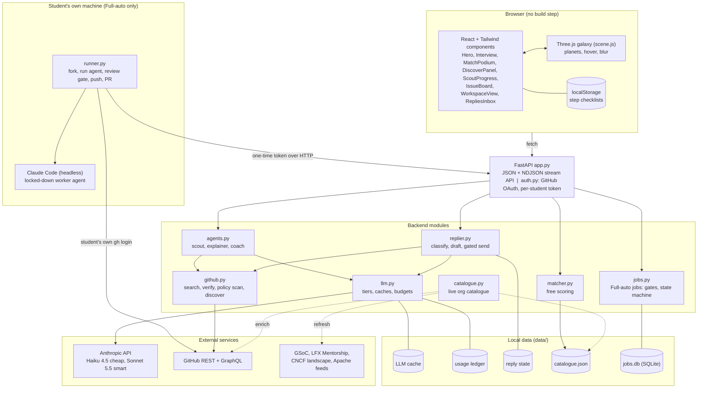
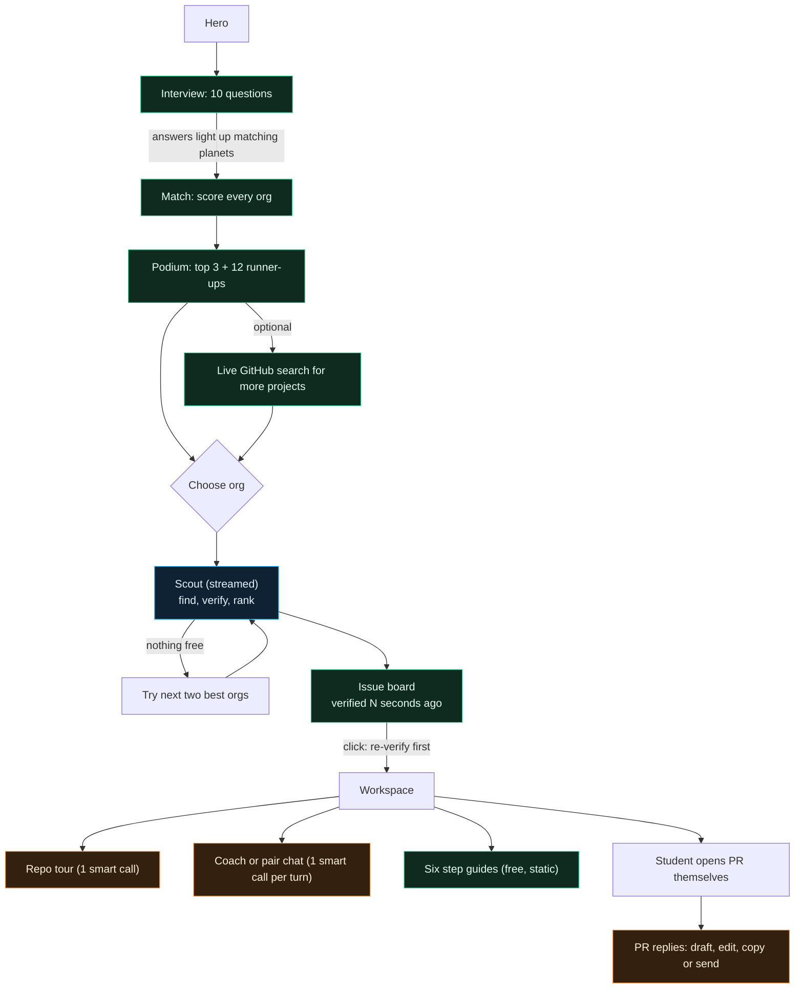
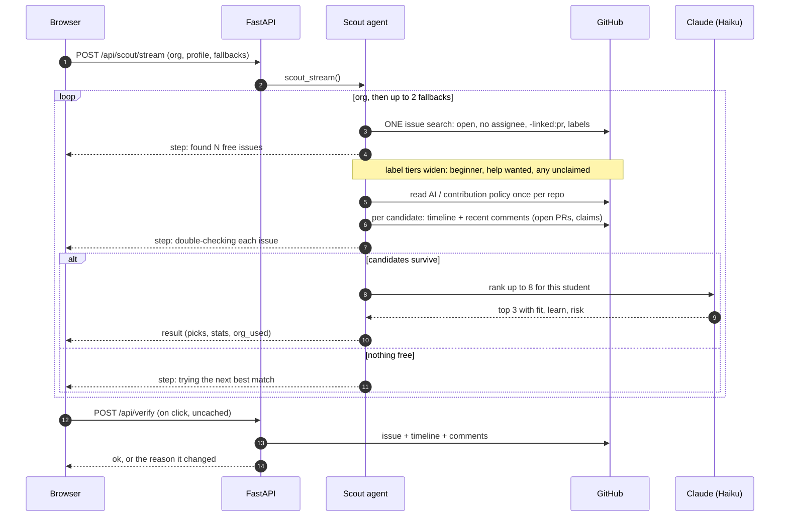
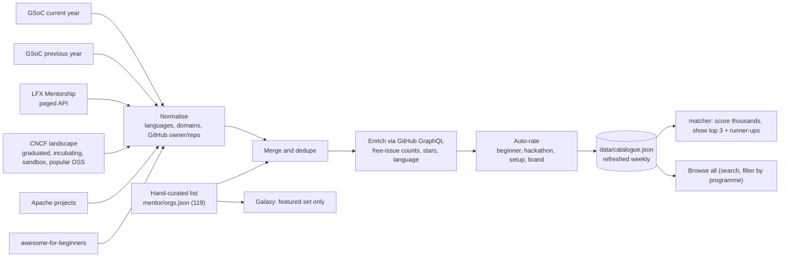
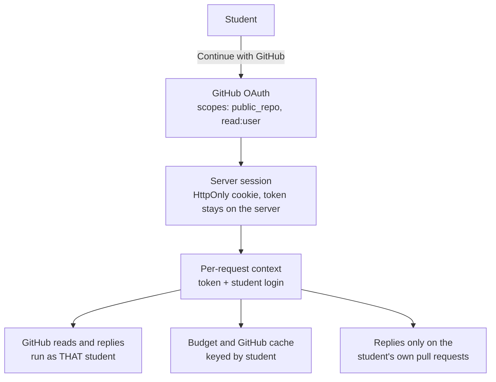
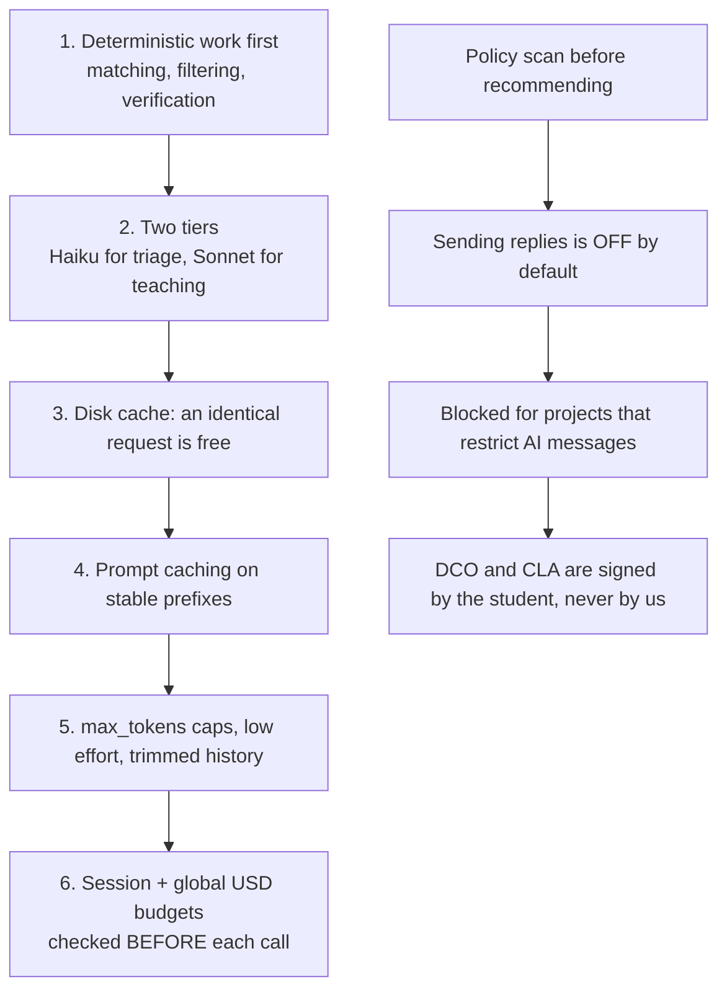
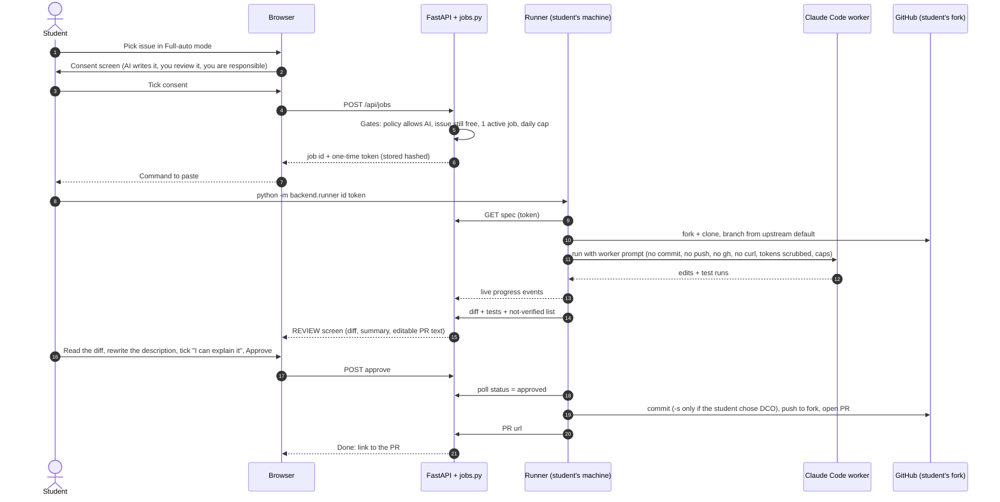
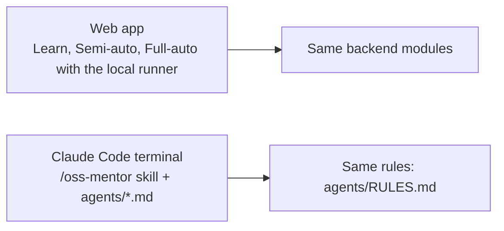

# Architecture

Diagrams are Mermaid, so they render on GitHub. A rendered picture of the whole set is in `docs/architecture.png`.
Legend: solid = built and tested; dashed = built but not wired in yet.

## 1. System overview

## 2. Student journey and where each step runs

Green = no model tokens. Blue = one cheap-model call. Orange = smart-model call.

## 3. Scouting (why a student always gets a result)

## 4. Catalogue pipeline (in progress: built, being wired in)

Each feed fails soft: a broken source is reported and skipped, never empties the catalogue. Auto-rated entries are labelled `auto`; curated ones `curated`.

## 5. Identity and tokens

## 6. Cost control and safety gates

## 7. Full-auto (Option A): the worker runs on the student's machine

Nothing is committed, pushed or opened before the Approve click. The agent never receives GitHub tokens. If the worker cannot produce a verified fix, the job ends as "failed" with its honest report and nothing is pushed.

## 8. Web app and terminal

